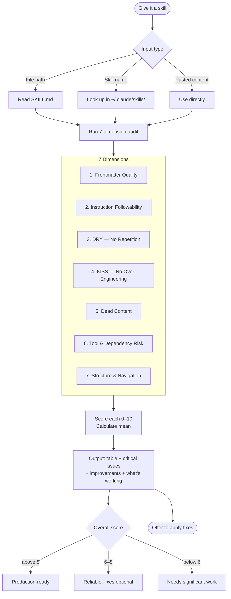

# Skill Auditor

A Claude Code skill that audits other Claude Code skills. Give it any `SKILL.md` and it returns a scored quality report with specific fixes — not just flags.

## What it does

Scores a skill across 7 dimensions (0–10 each), identifies critical issues and improvements, and offers to apply fixes directly.



## The 7 Dimensions

```mermaid
radar
    title Audit Dimensions
    "Frontmatter" : 10
    "Followability" : 10
    "DRY" : 10
    "KISS" : 10
    "Dead Content" : 10
    "Dependency Risk" : 10
    "Structure" : 10
```

| Dimension | What it checks |
|-----------|---------------|
| **Frontmatter Quality** | name, description completeness, trigger phrase count |
| **Instruction Followability** | imperative language, passive deferrals, code-fence output traps, ambiguous placeholders |
| **DRY** | repeated instructions, paraphrased re-statements, redundant sections |
| **KISS** | mode count, conditional complexity, premature flexibility, length vs task |
| **Dead Content** | unreferenced sections, tips that restate criteria, placeholder content |
| **Tool & Dependency Risk** | MCP requirements, shell binary assumptions, hardcoded URLs, assumed context |
| **Structure & Navigation** | section headings, tables vs prose, linear flow, wall-of-text |

## Scoring

Each dimension scores 0–10 with explicit deduction rules. Final score is the mean.

| Score | Verdict |
|-------|---------|
| > 8.0 | Production-ready |
| 6.0–8.0 | Reliable, improvements optional |
| < 6.0 | Needs significant work before use |

## Installation

```bash
mkdir -p ~/.claude/skills/skill-auditor
curl -o ~/.claude/skills/skill-auditor/SKILL.md \
  https://raw.githubusercontent.com/b1rdmania/claude-skill-auditor/main/SKILL.md
```

## Usage

- *"Audit this skill: ~/.claude/skills/my-skill/SKILL.md"*
- *"Check my skill before I publish it"*
- *"Will Claude follow this skill?"*
- *"Score this skill"*
- *"Validate skill structure"*

After the audit, Claude will ask if you want the fixes applied directly to the file.

## What it catches

The most common skill failure modes:

- **Code-fence output traps** — output templates wrapped in triple backticks cause Claude to render them as literal code blocks instead of formatted output
- **Passive deferrals** — "ask the user which mode" patterns where the skill should infer and act
- **Duplicate modes** — portfolio audit = batch (just different framing), not worth a separate section
- **Repeated instructions** — the same rule stated twice in different sections
- **Ambiguous placeholders** — `[placeholder]` syntax Claude renders literally instead of filling in
